<div align="center">


# Shrinkk

**Short links, QR codes and a link-in-bio page — with analytics that tell you who's clicking.**

[**Live demo → shrinkk.vercel.app**](https://shrinkk.vercel.app)


<br/><br/>

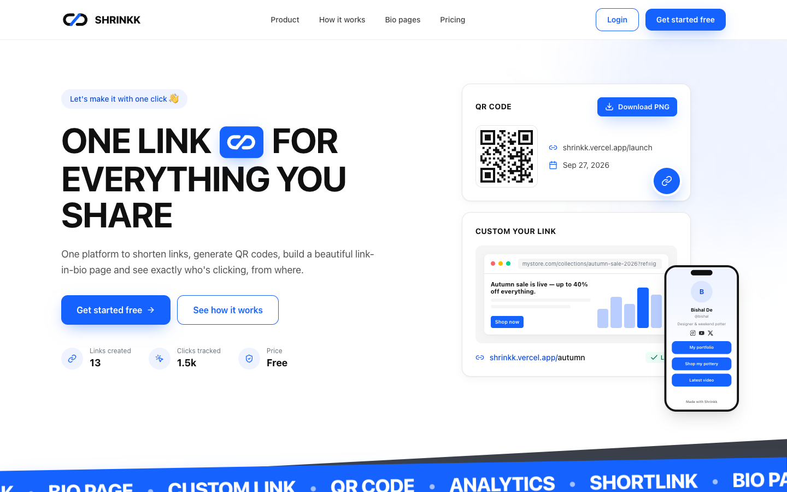

</div>

---

## Contents

- [Features](#features)
- [Screenshots](#screenshots)
- [Tech stack](#tech-stack)
- [Quick start](#quick-start)
- [Running against MongoDB](#running-against-mongodb)
- [Configuration](#configuration)
- [Deploying to Vercel](#deploying-to-vercel)
- [Project structure](#project-structure)
- [Routes](#routes)
- [Testing](#testing)
- [Contributing](#contributing)
- [Author](#author)

## Features

### 🔗 Link shortener
- Random or **custom aliases** (`shrinkk.vercel.app/launch`)
- Titles, **tags**, search and tag filters
- **Pause / resume** links and set **expiry dates**
- **Bulk actions** — delete, pause, activate, tag or add to your bio page in one go
- Built-in **UTM builder** for campaign tracking

### 👤 Link-in-bio pages
- Every user gets a public page at **`/@username`**
- Avatar upload, display name, bio and **social icons** (Instagram, X, TikTok, YouTube, LinkedIn, GitHub, email, website)
- **Drag-and-drop** button ordering with a **live phone preview** while you edit
- **Six themes** (Classic, Midnight, Minimal, Sunset, Forest, Mono) plus custom colours, button styles, corner radius and fonts
- Share sheet and a QR code for the page itself

### 📊 Analytics
- Clicks and **profile views** over 7, 30 or 90 days
- **Bio click-through rate** — how many visitors actually tap a button
- Breakdown by **country, device, browser, OS, referrer** and **traffic source** (direct, bio page or QR scan)
- Per-link analytics pages
- Privacy-friendly: **no raw IP addresses stored**, bots and your own visits aren't counted

### 🔳 QR codes
- A styled QR code for every link and bio page
- Custom foreground/background colours, **PNG or SVG** download

### ⚙️ Account
- Change username, email or password
- Delete your account and all its data
- CSRF protection, rate limiting and bcrypt-hashed passwords

## Screenshots

<table>
  <tr>
    <td width="50%"><b>Dashboard</b><br/>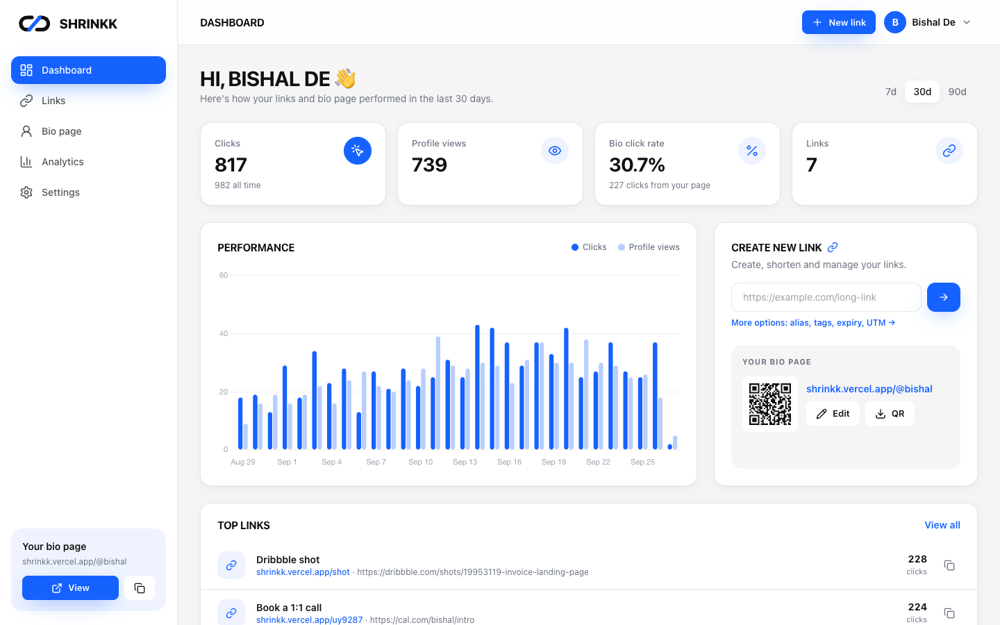</td>
    <td width="50%"><b>Links</b><br/>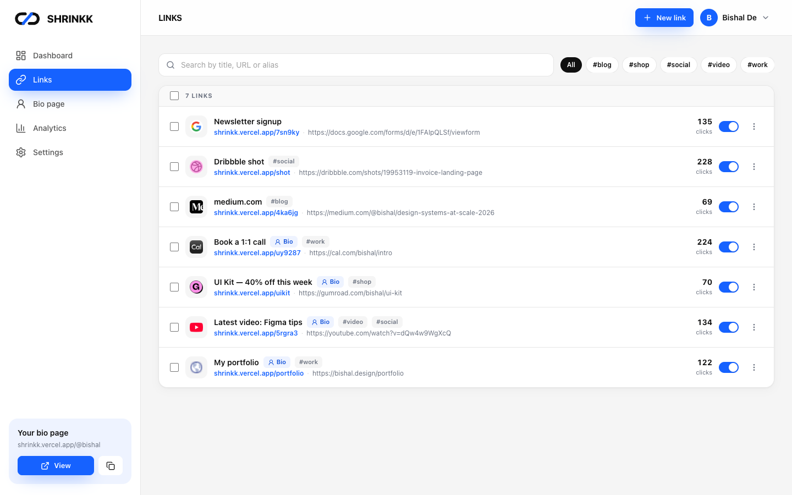</td>
  </tr>
  <tr>
    <td><b>Bio page editor with live preview</b><br/>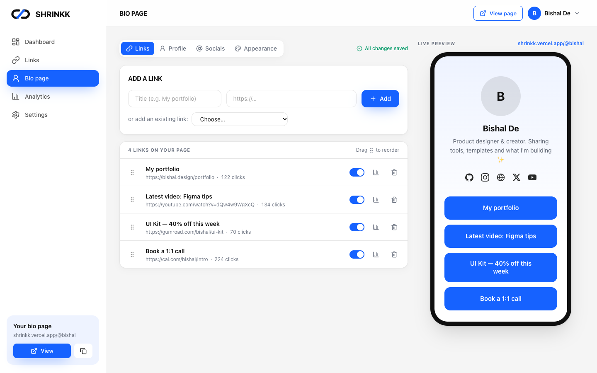</td>
    <td><b>Link analytics</b><br/>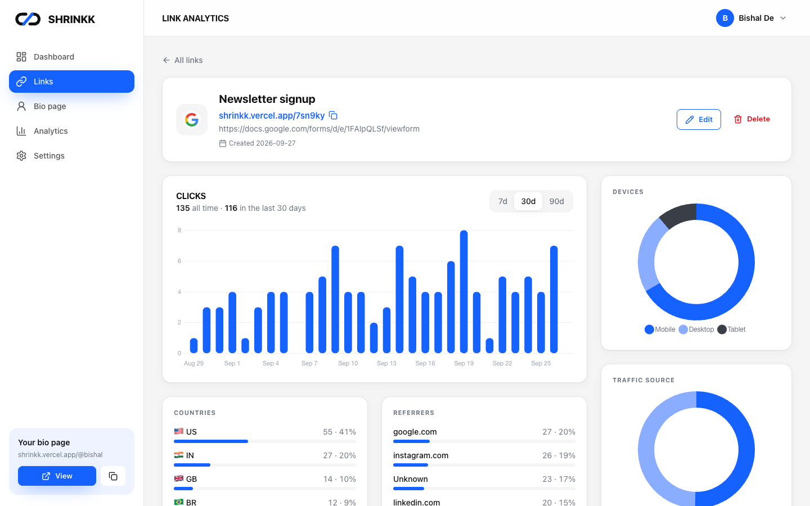</td>
  </tr>
  <tr>
    <td><b>Account analytics</b><br/>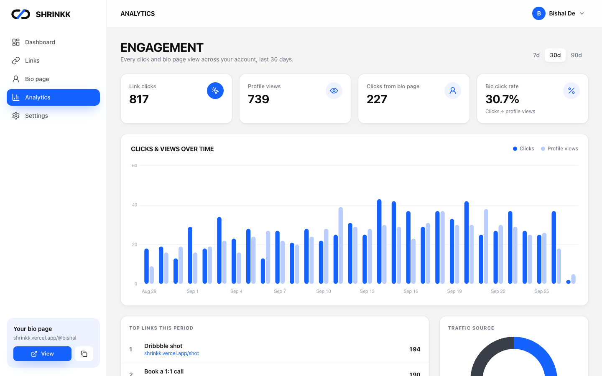</td>
    <td><b>Create a link</b><br/>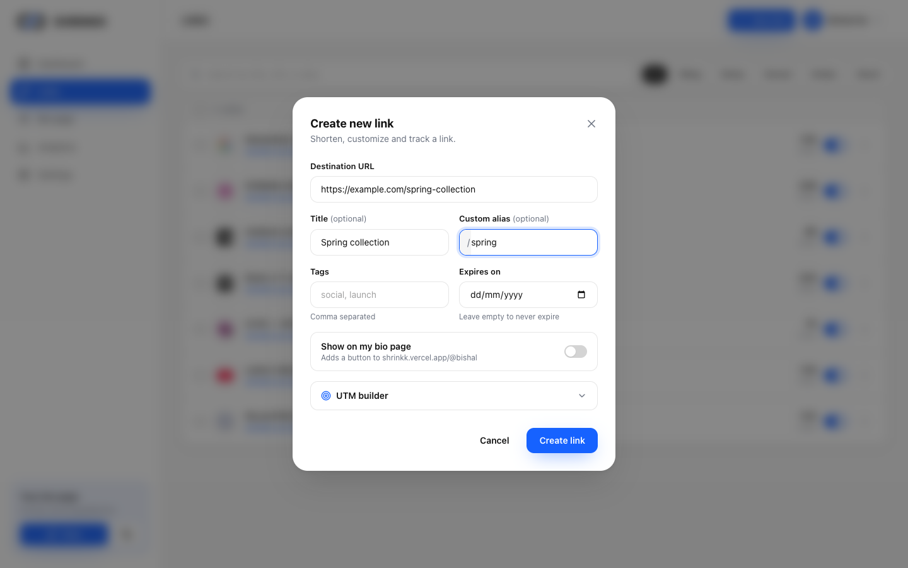</td>
  </tr>
  <tr>
    <td><b>Sign up</b><br/>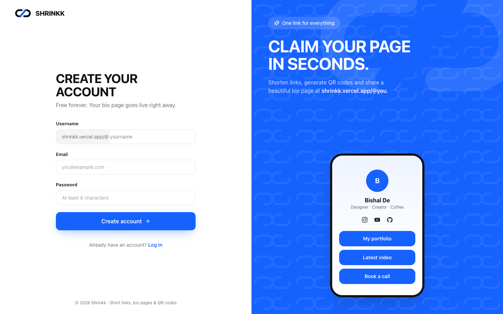</td>
    <td><b>Settings</b><br/>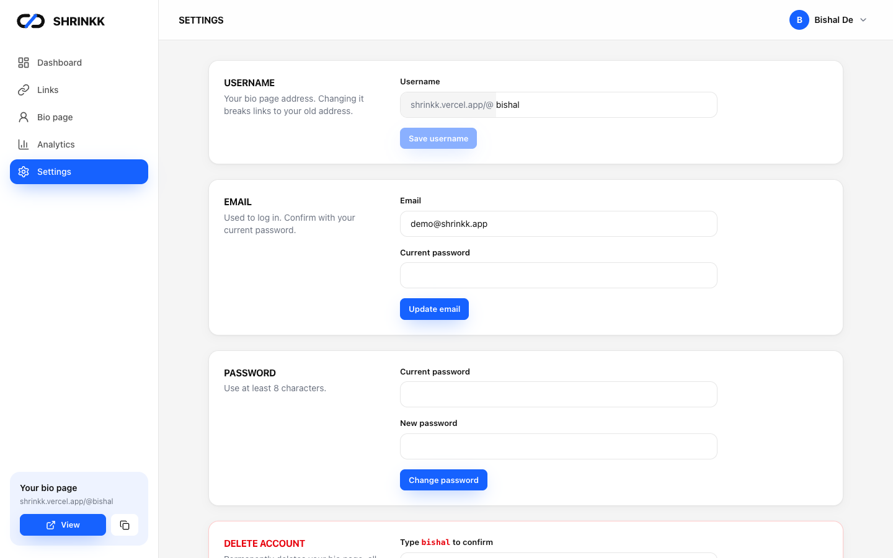</td>
  </tr>
</table>

**Public bio pages** — three users, three themes:

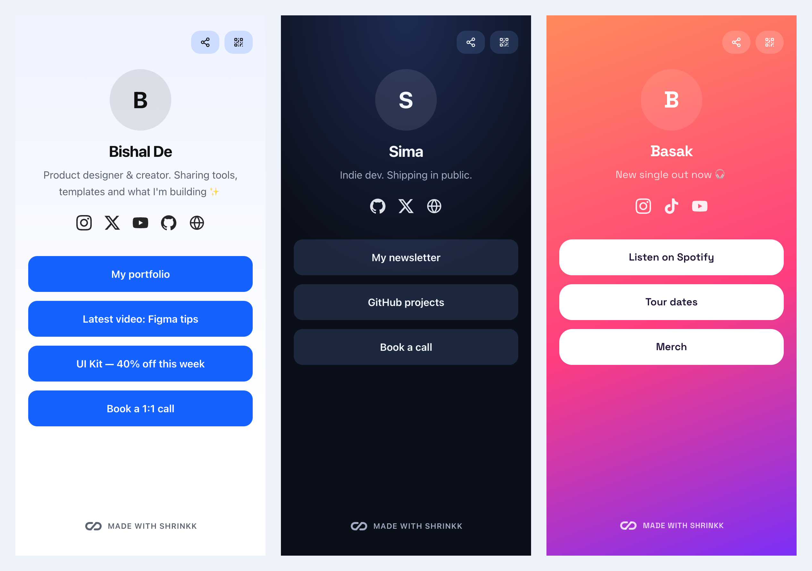

**Link-in-bio on the landing page:**

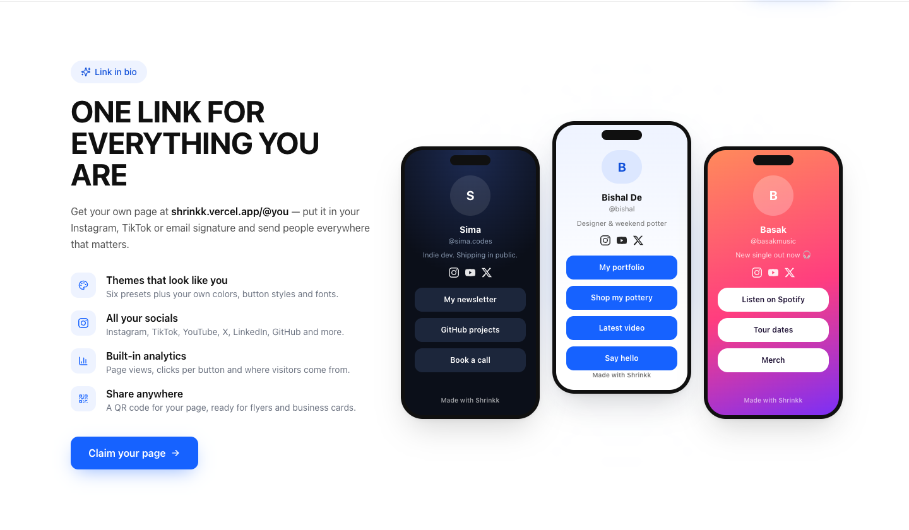

**Fully responsive** — landing page, dashboard and links on a phone:

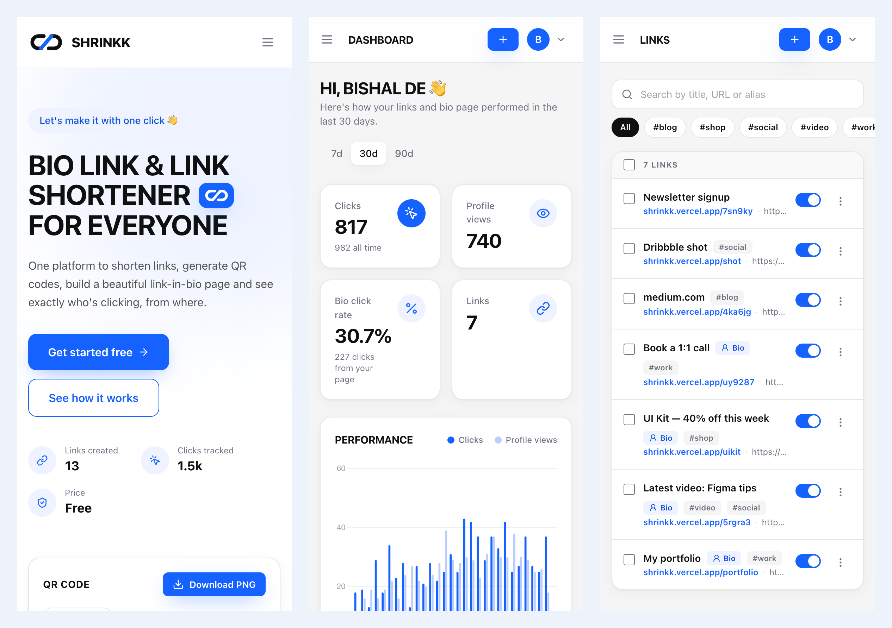

## Tech stack

| Layer      | Choice |
|------------|--------|
| Backend    | [Flask 3.1](https://flask.palletsprojects.com/) (app factory + blueprints), Flask-WTF (CSRF), Flask-Limiter |
| Database   | MongoDB via PyMongo; avatars in **GridFS** |
| Frontend   | Server-rendered Jinja templates, [Tailwind CSS v4](https://tailwindcss.com/), [Alpine.js](https://alpinejs.dev/), [Chart.js](https://www.chartjs.org/), [SortableJS](https://sortablejs.github.io/Sortable/) |
| Icons      | [Lucide](https://lucide.dev/) + [Simple Icons](https://simpleicons.org/), compiled into one SVG sprite |
| Images     | Pillow (avatars resized to 400×400 WebP), `qrcode` for QR codes |
| Hosting    | [Vercel](https://vercel.com/) — Python serverless function + static CDN |
| Tests      | pytest + mongomock (no database needed) |

## Quick start

No database needed — the demo runs on an in-memory MongoDB with sample data.

```bash
git clone https://github.com/bishalde/Shrinkk.git
cd Shrinkk

# Python dependencies
python -m venv .venv && .venv/bin/pip install -r requirements-dev.txt

# Build CSS and the icon sprite
npm install && npm run build

# Run the seeded demo
.venv/bin/python scripts/demo.py
```

Open **http://localhost:8080** and log in with:

| Email              | Password    |
|--------------------|-------------|
| `demo@shrinkk.app` | `demo12345` |

Sample bio pages: [`/@bishal`](http://localhost:8080/@bishal), [`/@sima`](http://localhost:8080/@sima), [`/@basak`](http://localhost:8080/@basak). Data resets when the server stops.

## Running against MongoDB

```bash
cp .env.example .env                  # set MONGO_URI and SECRET_KEY
.venv/bin/python scripts/init_db.py   # create indexes, migrate data from older versions
.venv/bin/flask --app app run --debug --port 8080
npm run dev:css                       # optional: rebuild CSS as you edit templates
```

Accounts created before the revamp don't have a username yet — they're asked to pick one on their next login.

## Configuration

| Variable     | Default                     | Notes |
|--------------|-----------------------------|-------|
| `MONGO_URI`  | `mongodb://localhost:27017` | Any MongoDB / Atlas URI. `mongomock://` gives a throwaway in-memory database |
| `MONGO_DB`   | `shrinkk`                   | Database name |
| `SECRET_KEY` | dev placeholder             | **Required in production** — the app refuses to start without it. Generate one with `python -c "import secrets; print(secrets.token_hex(32))"` |
| `BASE_URL`   | the visited domain          | Optional. Forces the domain used in short links and QR codes. Leave unset and links follow whatever domain serves the site |

## Deploying to Vercel

1. Import the repo in Vercel. [`vercel.json`](vercel.json) already sets the build (`npm run build`), serves `public/` from the CDN and routes everything else to the Flask function in [`api/index.py`](api/index.py).
2. Add `MONGO_URI`, `MONGO_DB` and `SECRET_KEY` under **Project → Settings → Environment Variables**.
3. In MongoDB Atlas, allow connections from Vercel (**Network Access → `0.0.0.0/0`**).
4. Run `scripts/init_db.py` once against the production database.

Visitor country and city come from Vercel's geo headers, so they only show up once deployed.

<details>
<summary><b>Docker</b></summary>

```bash
docker build -t shrinkk .
docker run -p 8080:8080 --env-file .env shrinkk
```
</details>

## Project structure

```
├── app.py                 # App factory: config, blueprints, error pages
├── config.py              # Settings read from the environment
├── extensions.py          # CSRF, rate limiter, repository access
├── api/index.py           # Vercel entry point
├── models/                # MongoDB access: users, links, analytics events, GridFS media
├── routes/
│   ├── pages.py           # Landing page + anonymous shortener
│   ├── auth_routes.py     # Sign up, log in, onboarding
│   ├── dashboard.py       # Dashboard, links, bio editor, analytics, settings
│   ├── api.py             # JSON endpoints used by the dashboard
│   └── public.py          # /@username pages, QR codes, avatars, short-link redirects
├── services/              # Link rules, themes, socials, QR, images, visitor info
├── utils/                 # Validators, formatting filters, serializers, auth helpers
├── templates/             # Jinja layouts, pages, partials and UI macros
├── assets/app.css         # Tailwind source (design tokens + components)
├── public/static/         # Built CSS, icon sprite, JS, favicon (served by the CDN)
├── scripts/               # demo.py, init_db.py, build-icons.mjs
└── tests/                 # pytest suite
```

## Routes

| Path | What it does |
|------|--------------|
| `/` | Landing page with a quick shortener |
| `/signup`, `/login` | Authentication |
| `/dashboard` | Overview: stats, performance chart, top links |
| `/dashboard/links` | Search, filter, bulk-edit links |
| `/dashboard/links/<id>` | Per-link analytics and QR studio |
| `/dashboard/bio` | Bio page editor with live preview |
| `/dashboard/analytics` | Account-wide analytics |
| `/dashboard/settings` | Username, email, password, delete account |
| `/@<username>` | Public bio page |
| `/@<username>/qr.png` | QR code for a bio page (`.svg` too) |
| `/qr/<code>.png` | QR code for a short link (`?fg=`, `?bg=`, `?dl=1`) |
| `/<code>` | Short-link redirect (`?src=bio` / `?src=qr` attribute traffic) |

## Testing

```bash
.venv/bin/python -m pytest
```

The suite uses mongomock, so it runs without a database.

## Contributing

Contributions are welcome!

1. ⭐ Star and fork the repo
2. Clone your fork: `git clone https://github.com/<your-username>/Shrinkk`
3. Create a branch: `git checkout -b my-feature`
4. Make your changes and run `pytest`
5. Commit and push: `git push -u origin my-feature`
6. Open a pull request 🎉

## Author

**Bishal De**

<p>
<a href="https://www.instagram.com/bishal_de/"></a>
<a href="https://www.linkedin.com/in/bishalde/"></a>
<a href="https://github.com/bishalde/"></a>
</p>

If Shrinkk is useful to you, you can support it here:

<a href="https://www.buymeacoffee.com/bishalde"></a>
<a href="https://ko-fi.com/bishalde"></a>

### Contributors ✨

<a href="https://github.com/bishalde/Shrinkk/graphs/contributors">
  
</a>

Thank you to everyone who has contributed to Shrinkk 💙
