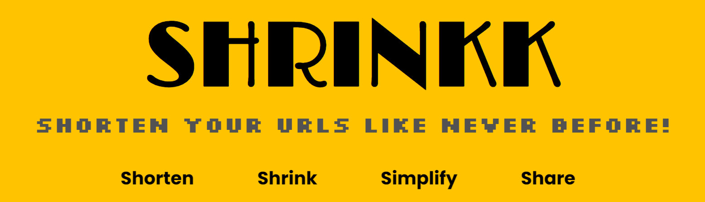
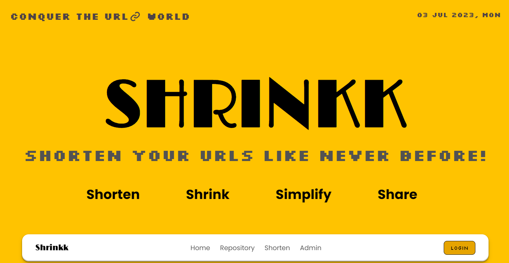
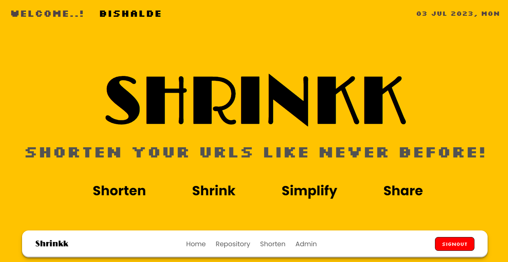
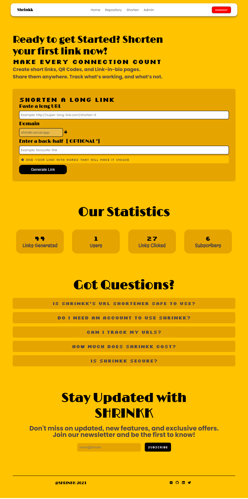
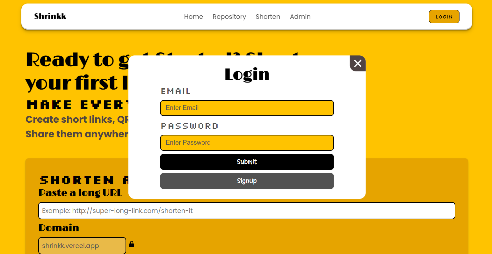
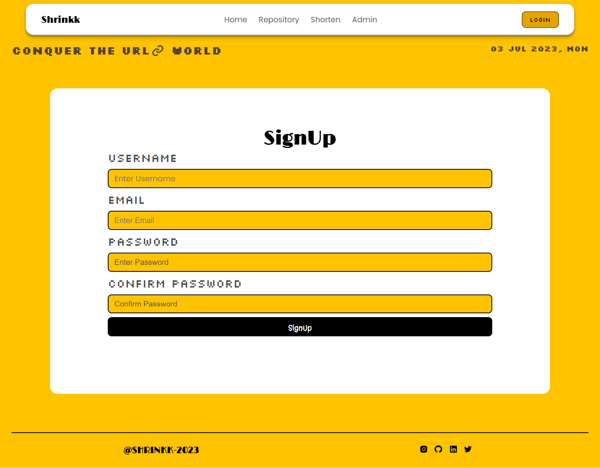
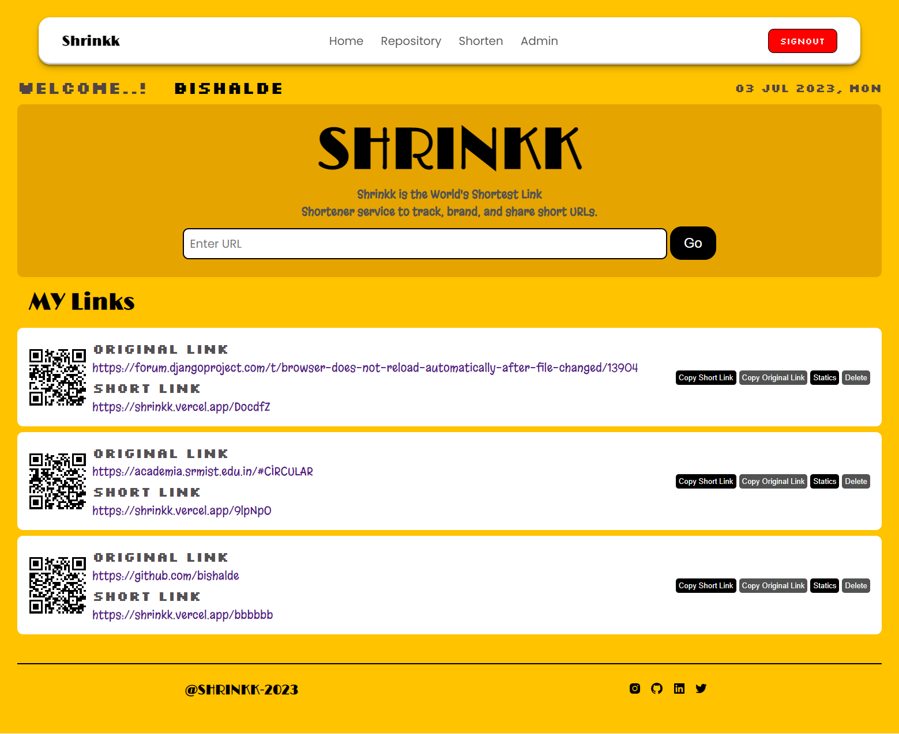

<h3 align="center">
  <br/>
  " Shorten Your LINKS Like Never Before.! "<br/>
  <a href="https://shrinkk.vercel.app" target=""_blank> 1. https://shrinkk.vercel.app</a><br />
  <a href="https://shrinkk.onrender.com" target=""_blank> 2. https://shrinkk.onrender.com</a>
</h3>


<div align="center">
  
[](http://thismypc.com/)
</div>

<div align="center">
&nbsp;&nbsp;&nbsp;&nbsp;&nbsp;&nbsp;</p>
</div>


### Repo Status ✳️


<div align="center">
 
	
	
	
 	 
<br>
	
	
	
	
</div>
<div align="center">
 <p> 

 
 </p>
 </div>
 

### Description 🌵


#### Shrinkk-Shorten Your LINKS Like Never Before.!
Shrinkk is the ultimate link shortening tool that revolutionizes the way you share URLs. With its cutting-edge technology, Shrinkk effortlessly shortens your long, cumbersome links into compact, shareable ones. Say goodbye to unsightly and intimidating URLs that discourage clicks. Shrinkk provides a sleek, elegant solution that not only saves characters but also enhances the aesthetics of your shared content. Its lightning-fast process ensures that your shortened links are ready in an instant, saving you precious time. Boost your online presence, increase engagement, and maximize click-through rates with Shrinkk's powerful link shrinking capabilities. Experience the future of link management with Shrinkk.
### Features 😱


- Customized Link Generation
- QR Code Generation
- Secure and Reliable
- Advanced Link Shortening
- Secure and Reliable
- Cross platform

### Installation Of Modules 🚀


```bash
pip install -r requirements.txt
```


### Steps For Contribution⚡


0. Star ⭐

1. Fork 

2. Clone the forked repository.
```css
git clone https://github.com/<your-github-username>/Shrinkk
```
  
3. Navigate to the project directory.
```py
cd Shrinkk
```

4. Create a new branch.
```css
git checkout -b <your_branch_name>
```

5. Make changes.

6. Stage your changes and commit
```css
git add -A

git commit -m "<your_commit_message>"
```

7. Push your local commits to the remote repo.
```css
git push -u origin <your_branch_name>
```

8. Create a Pull Request.

9. Congratulations! 🎉 you've made your contribution.

### Screenshots 📷


##### HomePage




##### Full HomePage


##### Login Page


##### SignUp Page


##### Public Shorten URL Page


##### User Shorten URL Page



### Social Links 🔗


<p align="center"><a href="https://www.instagram.com/bishal_de/" target='_blank'></a>&nbsp;
<a href="https://www.linkedin.com/in/bishalde/" target='_blank'></a>&nbsp;
<a href="https://github.com/bishalde/" target='_blank'></a>&nbsp;
<a href="@itsbishalde" target='_blank'></a>&nbsp;<br/>
<a href="https://wa.me/+918299260163?text=Hello!" target='_blank'></a>&nbsp;
<a href="https://www.hackerrank.com/bishalde" target='_blank'></a>&nbsp;
<a href="https://www.codechef.com/users/bishalde" target='_blank'></a>&nbsp;</p>

### Give Me A Bow 🏹

<a href="https://www.buymeacoffee.com/bishalde" target='_blank'></a>&nbsp;<a href="https://ko-fi.com/bishalde" target='_blank'></a>


### Our Contributors ✨


Thank you to all the amazing contributors who have made this project possible!!💝